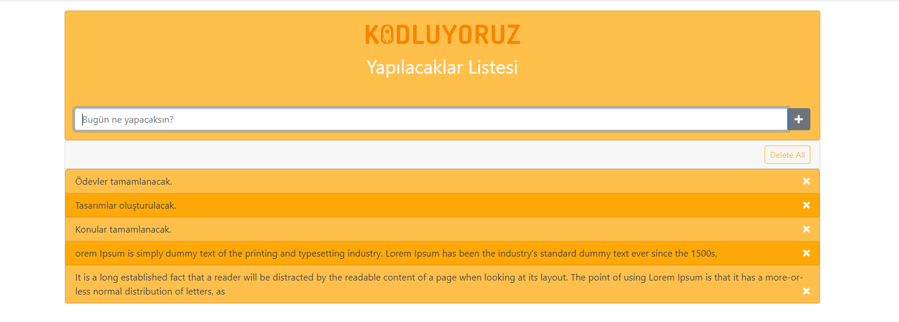

# toDoApp

## Introduction

**This project is built on HTML+Css+JavaScript+Bootstrap. It is a responsive design.** :memo:

## DEMO

 *Here's how it looks in Vercel:* [Vercel](https://to-do-app-one-sigma.vercel.app/)

## ScreenShot

# toDoApp